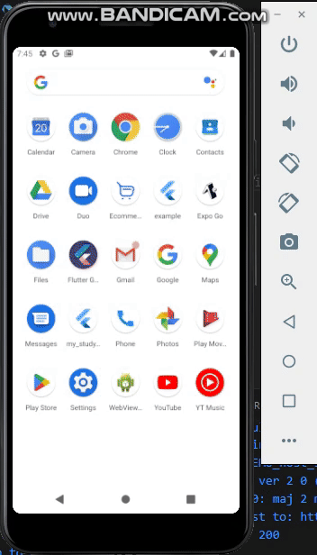

# WayPoint



## Features

- PhoneVerify
- Stripe Payment Integration

## Supported Platforms

WayPoint has been built to support multiple platforms.
These include:

- Android
- web

## Running

One can run the WayPoint locally for any of these platforms. For desktop platforms,
please see the [Flutter docs](https://docs.flutter.dev/desktop) for the latest
requirements.

```bash
go to the project directory
flutter pub get
flutter run
```

<details>
<summary>Troubleshooting</summary>

### Flutter `stable` channel

```bash
flutter channel stable
flutter upgrade
```

</details>

## Development

<details>
  <summary>Generating localizations</summary>

If this is the first time building the Flutter Gallery, the localized
code will not be present in the project directory. However, after running
the application for the first time, a synthetic package will be generated
containing the app's localizations through importing
`package:flutter_gen/gen_l10n/`.

```bash
flutter pub get
flutter pub run grinder l10n
```

See separate [README](lib/l10n/README.md) for more details.
